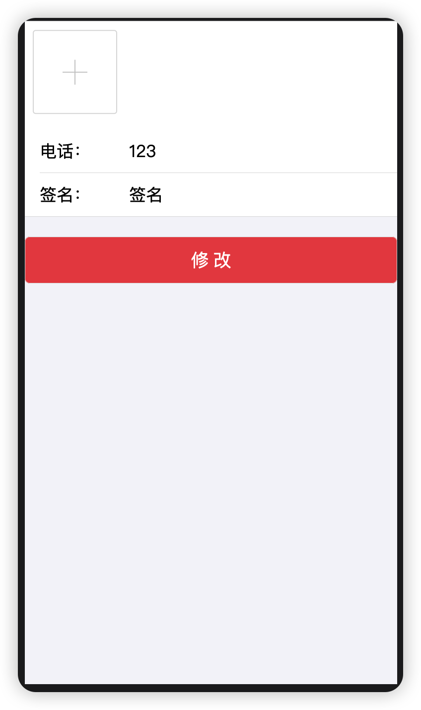

## umi-travel
- 基于`umi3.x`项目
- node版本`v14.21.1`

## 项目完成进度
- [x] 首页
- [x] 订单页面
- [x] 房屋详情页面
- [x] 个人中心
- [x] 登录页面
- [x] 注册页面
- [ ] 与后台联调接口

## 截图

## 项目运行

- `yarn start` 启动项目，带有热更新功能，`mock`数据
- `yarn start:no-mock` 启动项目，带有热更新功能，不带`mock`数据（启动关联后台服务）
- `yarn build` 打包项目，打包后的文件在`dist`目录下

## 项目参考资料
- [umi官网](https://umijs.org/zh-CN)
- [React+React Hook+Egg造轮子 全栈开发旅游电商应用](https://coding.imooc.com/class/chapter/452.html#Anchor)
- [千锋教育前端框架Umi3教程](https://www.bilibili.com/video/BV1pG411879j/?spm_id_from=333.337.search-card.all.click&vd_source=c5abf1ba032ca00c06ebba96e3ff445e)
